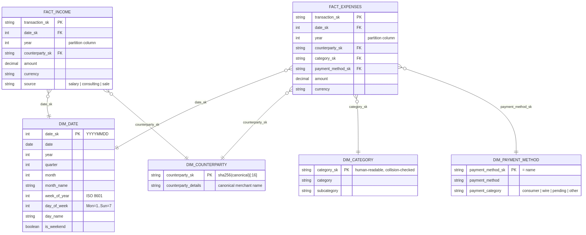

# INGot

Personal-finance ETL over ING Bank transaction exports. Implements a 
medallion architecture (bronze → silver → gold) with Kimball-style 
dimensional modeling and a fuzzy-match categorization pipeline.

## Table of Contents

- [Why](#why)
- [Architecture](#architecture)
  - [Gold model](#gold-model)
  - [Categorization cascade](#categorization-cascade)
  - [Data quality gate](#data-quality-gate)
- [Layout](#layout)
- [Run](#run)
  - [Command-line arguments](#command-line-arguments)
  - [Tests](#tests)
- [Stack](#stack)
- [Roadmap](#roadmap)
- [Design notes](#design-notes)
- [AI usage](#ai-usage)
- [What I learned](#what-i-learned)

## Why

I wanted a realistic playground for analytics-engineering practices 
on data I actually own:

- Defensive ingestion of messy real-world CSVs (encoding detection, 
  header normalization, footer rows, schema drift).
- A clean separation of raw, cleaned, and modeled layers.
- Surrogate keys, dimensions, and fact tables — not one wide flat 
  table.
- A pragmatic categorization approach that mixes deterministic 
  classification with fuzzy matching for merchant variability.
- Support for both single-file and multi-file CSV ingestion.

## Architecture


<details>
<summary>Pipeline layers</summary>

```
+---------------------------+
|           INPUT           |
|---------------------------|  
|         raw/*.csv         |
+-------------+-------------+
              |
              v
+---------------------------+
|        BRONZE             |
|---------------------------|
| - ingest                  |
| - hashing                 |
| - provenance tracking     |
| - raw schema              |
+-------------+-------------+
              |
              v
+---------------------------+
|         SILVER            |
|---------------------------|
| - typing (column casting) |
| - cleaning (null, dup)    |
| - data standardization    |
| - event classification    |
+-------------+-------------+
              |
              v
+---------------------------+
|          GOLD             |
|---------------------------|
| Dimensional model         |
| (Kimball)                 |
|                           |
| - fact tables             |
| - dimension tables        |
| - categorization          |
+-------------+-------------+
              |
              v
+---------------------------+
|         DQ GATE           |
|---------------------------|
| - SK uniqueness           |
| - FK integrity            |
| - reconciliation          |
| - amount sign / ranges    |
+-------------+-------------+
              |
              v
+---------------------------+
|          OUTPUT           |
|---------------------------|
| facts: partitionBy(year)  |
| dims:  coalesce(1)        |
|        output/*.parquet   |
+---------------------------+
```
</details>

| Layer  | Responsibility | Tech |
| --- | --- | --- |
| Bronze | Encoding detection, metadata parse, header normalization, schema alignment, provenance columns | Polars + PySpark |
| Silver | Type casting, trimming, event classification, drop-row safety check (no silent loss of valid dates) | PySpark + SQL (`config/silver_classifications.sql`) |
| Gold   | Fact/dim split, surrogate keys, fuzzy categorization with canonicalized counterparties | PySpark + rapidfuzz |
| DQ     | Pre-write gate: SK uniqueness, FK integrity, non-null FKs, amount-sign and date-range checks, reconciliation | PySpark (`pipeline/dq.py`) |

### Gold model

- `fact_expenses`: outflows joined to category, counterparty, date, 
  and payment method dimensions.
- `fact_income`: inflows split by source (salary / consulting / sale).
- `dim_date`: calendar with ISO week, day-of-week, weekend flag.
- `dim_counterparty`: canonicalized merchant/payee with surrogate key.
- `dim_category`: category / subcategory hierarchy with an inferred 
  member (`unclassified`) so every fact row resolves to a dim row.
- `dim_payment_method`: static lookup grouping `payment_method` 
  (`card`, `blik`, `transfer`, `sepa_transfer`, `currency_exchange`, 
  `pending`, `other`) into `payment_category` 
  (`consumer` / `wire` / `pending` / `other`).

Surrogate keys:

| SK | Type | Derivation |
| --- | --- | --- |
| `transaction_sk` | string | `sha256(date~tx_id~counterparty~amount)[:32]` (128-bit). Content-hash by design — identical observables collapse, making re-runs idempotent. |
| `date_sk` | int | `YYYYMMDD` natural key (also used as parquet partition column on facts). |
| `counterparty_sk` | string | `sha256(canonical)[:16]` (64-bit). Empty canonical resolves to a sentinel `"unknown"` row so the FK is never NULL. |
| `category_sk` | string | Human-readable from `(category, subcategory)`; collision-checked at build time. `("Unclassified","Unclassified") → "unclassified"` is always present. |
| `payment_method_sk` | string | The method name itself (`"card"`, `"blik"`, …) — small fixed set, no benefit to hashing. |

### Categorization cascade

Each transaction in `fact_expenses` is assigned a `category_sk` 
through a three-stage pipeline:

1. **Counterparty canonicalization** (`pipeline/counterparty.py`): 
   the raw counterparty string is run through a regex cleanup 
   (legal entity suffixes, postal codes, addresses, cities, 
   diacritics) and an alias table for known recurring merchants. 
   The output is an ASCII-normalized canonical form used both for 
   `dim_counterparty` and for downstream matching.

2. **Fuzzy keyword match** (`pipeline/categories.py`): both the
   counterparty and the description are scored independently against
   a curated keyword list in `config/private_categories.toml` using
   `rapidfuzz.token_set_ratio` (threshold 80). The higher-scoring
   field wins. Token-set semantics avoid the character-level sliding
   false positives that an earlier `partial_ratio` implementation
   produced (e.g. `"xyz123nothing"` matching `"notino"` at 83).

3. **Inferred member fallback**: transactions with no match above 
   threshold are assigned `category_sk = unclassified` rather than 
   `NULL`. This preserves referential integrity in the fact and lets 
   classification quality be measured directly 
   (`COUNT(*) WHERE category_sk = 'unclassified'`).

### Data quality gate

`pipeline/dq.py` runs after gold is built and before any table is
written. The pipeline must refuse to publish wrong data, not just log
warnings. Each check returns a `CheckResult(name, passed, detail)`;
`run_all` aggregates results, logs every PASS/FAIL, and raises a
`DataQualityError` listing every failure if any check failed.

Checks performed:

- **SK uniqueness** on every dimension.
- **FK integrity** for every fact→dim edge (left-anti join, 0 orphans).
- **Non-null FKs** on facts (catches gaps in dim lookups).
- **`fact_expenses.amount ≥ 0`** (the fact stores absolute amounts; the
  sign lives in the categorization, not the measure).
- **Date range coverage**: every fact `date_sk` is inside `dim_date`.
- **Reconciliation**: `silver |amount| = expense_total + excluded_total`
  to within `0.01`. Income lives inside the "excluded" bucket because
  income rows have `include_in_expense = false` — adding `income_total`
  separately would double-count.

The same invariants are also covered by pytest in
`tests/test_invariants.py`. Tests give granular failure messages in
CI; the runtime DQ gate blocks bad data from reaching `output/`.
Different phase, same contract.

## Layout

```
.
├── config/                              # SQL + TOML data only
│   ├── silver_classifications.sql
│   ├── private_categories.example.toml          # copy → .toml (gitignored)
│   └── private_classifications.example.toml     # copy → .toml (gitignored)
├── pipeline/
│   ├── bronze.py                        # CSV ingestion
│   ├── silver.py                        # Cleaning + classification
│   ├── gold.py                          # Facts + dims orchestration
│   ├── dimensions.py                    # dim_date, dim_counterparty, dim_category, dim_payment_method
│   ├── categories.py                    # Fuzzy matcher
│   ├── counterparty.py                  # Canonicalization
│   ├── dq.py                            # Pre-write data quality gate
│   ├── udf.py                           # Spark UDFs
│   └── schemas/
│       ├── bronze.py                    # PySpark StructType + column mappings
│       └── dim.py                       # PySpark StructType for dimensions
├── utils/
│   ├── spark.py                         # SparkSession factory
│   └── logger.py
├── tests/                               # Invariants, header parsing, categorization, dq
├── main.py                              # Pipeline entrypoint
├── pyproject.toml
└── uv.lock
```

`raw/`, `output/`, `log/`, `spark-warehouse/` are runtime artifacts 
(gitignored).

<details>
<summary>Output layout</summary>

```text
output/
├── dim_category
│   ├── part-00000-fadb7017-6007-4984-b662-d3a6f4b1db7e-c000.snappy.parquet
│   └── _SUCCESS
├── dim_counterparty
│   ├── part-00000-3702eccb-461d-49d7-86f1-9c7bb42e43bf-c000.snappy.parquet
│   └── _SUCCESS
├── dim_date
│   ├── part-00000-839c6262-107b-4902-b097-f3636255f083-c000.snappy.parquet
│   └── _SUCCESS
├── dim_payment_method
│   ├── part-00000-87fe0448-ecff-4be2-a600-d44d07ca0ecf-c000.snappy.parquet
│   └── _SUCCESS
├── fact_expenses
│   ├── _SUCCESS
│   ├── year=2025
│   │   └── part-00000-b79511d2-ff9b-4d57-9c06-9a3a78843c92.c000.snappy.parquet
│   └── year=2026
│       └── part-00000-b79511d2-ff9b-4d57-9c06-9a3a78843c92.c000.snappy.parquet
└── fact_income
    ├── _SUCCESS
    ├── year=2025
    │   └── part-00000-b8c32514-57db-427f-a9ef-874af987d3ea.c000.snappy.parquet
    └── year=2026
        └── part-00000-b8c32514-57db-427f-a9ef-874af987d3ea.c000.snappy.parquet

```
</details>

## Run

Requires Python 3.12+ and [`uv`](https://docs.astral.sh/uv/).

```bash
uv sync
cp .env.example .env
cp config/private_classifications.example.toml config/private_classifications.toml
cp config/private_categories.example.toml      config/private_categories.toml
# edit both files with your own merchant / IBAN patterns and category vocabulary
mkdir -p raw && cp /path/to/your_export.csv raw/
uv run python main.py
```

### Command-line arguments
- `--input`, `-i`: Input path (raw data directory)
- `--out`,  `-o`: Output directory for pipeline results
- `--format`, `-f`: Output format (default: parquet)
- `--help`, `-h`: Help


### Tests:

```bash
uv run pytest
```

Outputs Parquet tables to `output/`. Facts are partitioned by `year`
(e.g. `output/fact_expenses/year=2025/...`); dimensions are written as
single coalesced files.

Both format and input/output path(s) can be customised via the [command-line arguments](#command-line-arguments)

## Stack

PySpark 4 · Polars · pandas · pyarrow · rapidfuzz · chardet · 
pytest · uv

## Roadmap

- [x] Test invariants, see [Data quality gate](#data-quality-gate).
- [ ] Migrate transformations to dbt
- [ ] Incrementally load the warehouse layer in BigQuery or 
      Databricks
- [ ] Push aggregated monthly expenses to Google Sheets (the 
      original goal of the project)

## Design notes

A few choices in this project are unconventional enough to be worth 
documenting.

**Spark and Polars together.** Pandas alone would have been 
sufficient for this volume of data. The choice of PySpark is 
deliberate: it forces me to work with the tooling and constraints 
common in distributed pipelines and lakehouse environments. Polars 
sits in front of Spark only in the bronze layer, where it handles 
encoding detection and pre-ingestion validation faster than Spark 
on a single file. The handoff from Polars to Spark via Arrow is 
one of the cleaner integrations in the modern Python data stack.

**Medallion architecture.** Medallion is the de-facto pattern in 
lakehouse environments. Building it manually before adopting 
frameworks (dbt, Delta Live Tables) was a way to internalize what 
each layer is solving — provenance and immutability in bronze, 
typing and event classification in silver, modeling and 
denormalization-for-consumption in gold. Frameworks make sense once 
the model is clear; reaching for them first hides the constraints.

**Mixing SQL and DataFrame API.** `silver_classifications.sql` is 
written as raw SQL because dense `CASE` logic over many patterns 
reads better as SQL than as chained `when().otherwise()` calls. 
The gold layer uses the DataFrame API because it's mostly 
lightweight joins and column projections, where Python is shorter 
and more composable. The split is by readability, not capability: 
either layer could be written in either style.

## AI usage

This project was developed with Claude as a paired collaborator. 
The medallion structure, the dimensional model, and the 
categorization approach (canonicalization → fuzzy match → inferred 
member) were designed by me. Claude assisted with the regex 
implementations in `pipeline/counterparty.py`, the cascade matching 
logic in `pipeline/categories.py`, the refactor of the gold layer 
into a Kimball star schema, and debugging classification routing 
issues that were subtle to spot manually. Architectural decisions 
and code review were mine; targeted implementation help was 
Claude's.

## What I learned

- The first iteration of the gold layer ended at flat fact tables 
with category and counterparty inlined as strings. It worked, but 
it wasn't a dimensional model — there were no dim tables, no 
surrogate keys, no separation between facts and the entities they 
reference. I rebuilt gold from scratch with `dim_counterparty`, 
`dim_category`, `dim_date`, and `dim_payment_method`, and fact 
tables that hold only foreign keys and measures. The refactor took 
roughly half the project's total time, and was where the actual 
Kimball intuition landed.

- Case sensitivity in the silver layer was a class of bug I hadn't 
expected. I had `TRIM(LOWER(...))` on counterparties but 
`UPPER(...) LIKE '%aldi%'` in the classification CASE — meaning 
that branch was dead code that never matched, and I didn't notice 
because other branches caught the same transactions through 
`description` patterns. Fixing it required normalizing both inputs 
and patterns to the same case once, in one place. The lesson: 
inconsistent casing across an SQL pipeline is silent, and the only 
defense is a single, enforced normalization rule.

- Sub-category names that repeat across macro-categories (`Insurance` 
under Home, Transport, and Health; `Maintenance` under Home and 
Transport) broke the categorization in a non-obvious way. The 
keyword-to-subcategory map used first-occurrence-wins, so all 
"insurance" matches routed to Home, and life-insurance transactions 
ended up classified as `home_insurance`. Disambiguating the 
subcategory names (`Home Insurance`, `Vehicle Insurance`, 
`Life Insurance`) fixed the routing without touching the matching 
logic. Taxonomy ambiguity tends to manifest as data quality bugs.

- Single source of truth for surrogate keys is more than style. While 
refactoring gold I noticed `counterparty_sk` was being computed in 
two places — once in `dim_counterparty` and once in the fact 
builder. Both used `SHA2` over the canonical form, so the values 
*probably* matched. The word "probably" is the problem: if the two 
canonicalization paths ever diverged, fact rows would point to 
counterparty IDs that don't exist in the dim, silently. I 
consolidated the SK computation in `dim_counterparty` and made the 
fact builder pull through a join.

- NULL foreign keys are the wrong way to represent unmatched data. 
The early version of the categorization step left `category_sk = 
NULL` for transactions with no fuzzy match, which broke joins and 
made it impossible to count how many were unclassified without 
special-casing NULL. The Kimball pattern is an "inferred member": a 
real row in the dim with `category_sk = 'unclassified'` that 
unmatched transactions point to. Referential integrity holds, 
classification quality is measurable as 
`COUNT(*) WHERE category_sk = 'unclassified'`, and the model stays 
clean.
